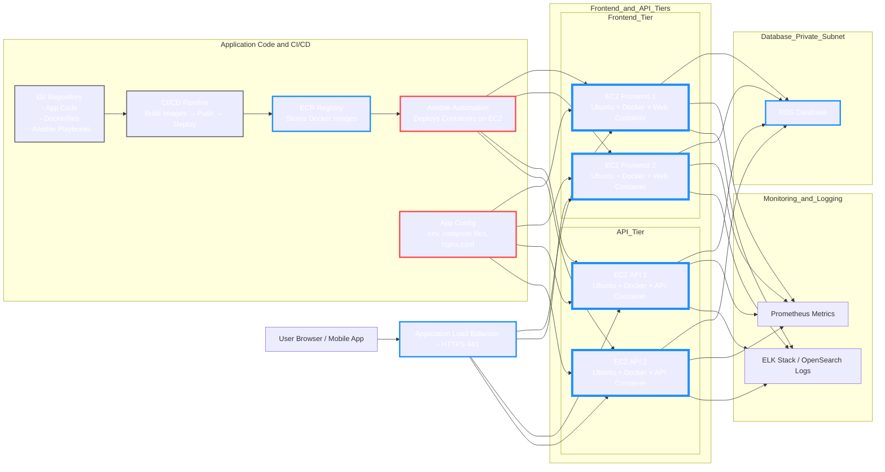

# ChefTec Modern Rebuild

A full, modern recreation of the **ChefTec** application using cloud-native patterns, Infrastructure-as-Code, containerization, and automated deployments.

---

## Table of Contents

1. [Project Goals](#project-goals)
2. [Scope](#scope)
3. [Cloud Deployment Diagram](#cloud-deployment-diagram)
4. [Why This Architecture? (Concise Explained)](#why-this-architecture-concise-explained)
5. [Tech Stack (Planned)](#tech-stack-planned)
6. [Status](#status)
7. [Purpose](#purpose)

---

## Project Goals

* Build separate **development** and **production** cloud environments
* Implement **authentication**, **user roles**, and **account management**
* Establish **Git-based workflows** for consistent development
* Deploy **scalable, secure, automated** cloud infrastructure
* Ensure long-term maintainability with Infrastructure-as-Code

---

## Scope

* Full **frontend + backend rebuild**
* **CI/CD automation** for building and deploying containers
* **Terraform-based Infrastructure-as-Code**
* **Ansible automation** for provisioning VMs and Docker services
* Standardized **environment configuration** across Dev/Prod
* Clear **architecture diagrams and documentation**

---

## Cloud Deployment Diagram

High-level view of ChefTec’s cloud deployment:

---

## Why This Architecture? (Concise Explained)

### **1. Terraform for Infrastructure**

Terraform handles **everything that should persist**: VPC, subnets, ALB, EC2 ASGs, RDS.

* Cloud infra must be reproducible
* Terraform produces a **single source of truth**
* Changes are versioned and safely previewed

**Why:** Infra should never be manually created.

---

### **2. Ansible for Host Configuration**

Ansible configures each EC2 instance after Terraform creates them:

* Installs packages, Docker, Nginx
* Deploys system-level settings
* Ensures servers are identical

**Why:** Configuring hosts is not Terraform’s job.

---

### **3. CI/CD for Application Delivery**

CI/CD builds container images and deploys them to the provisioned hosts:

* Separate from infra provisioning
* Automatically pushes updates
* Keeps environments consistent

**Why:** Code should deploy automatically—not tied to infra state.

---

### **4. Containers for Runtime Consistency**

The frontend and API run in containers on each EC2 instance:

* Isolates application behavior
* Same runtime in dev/prod
* Faster deployments

**Why:** No “works on my machine” problems.

---

### **5. 3-Tier Layout for Scalability & Clarity**

**Frontend → API → Database** tiers

* Each tier can scale independently
* Better fault isolation
* Industry standard architecture

**Why:** Clean separation of concerns.

---

### **6. RDS in Private Subnets**

Database stays private, never exposed to the internet:

* Most secure design
* Only app/API containers can reach it

**Why:** Databases must not be on public networks.

---

## Tech Stack (Planned)

| Layer                 | Tools                                |
| --------------------- | ------------------------------------ |
| **Infrastructure**    | Terraform                            |
| **Config Management** | Ansible                              |
| **Runtime**           | Docker containers                    |
| **Cloud Provider**    | AWS / Azure / GCP                    |
| **CI/CD**             | GitHub Actions / GitLab CI / Jenkins |
| **Monitoring**        | Prometheus, ELK/OpenSearch           |
| **App Framework**     | TBD                                  |
| **Database**          | TBD                                  |

---

## Status

**Active development**
Architecture, IaC layout, and base automation are being built.

---

## Purpose

This repository serves as a **learning platform** and **real-world rebuild** to strengthen skills in:

* Cloud engineering
* DevOps workflows
* Infrastructure automation
* Multi-tier architecture design
