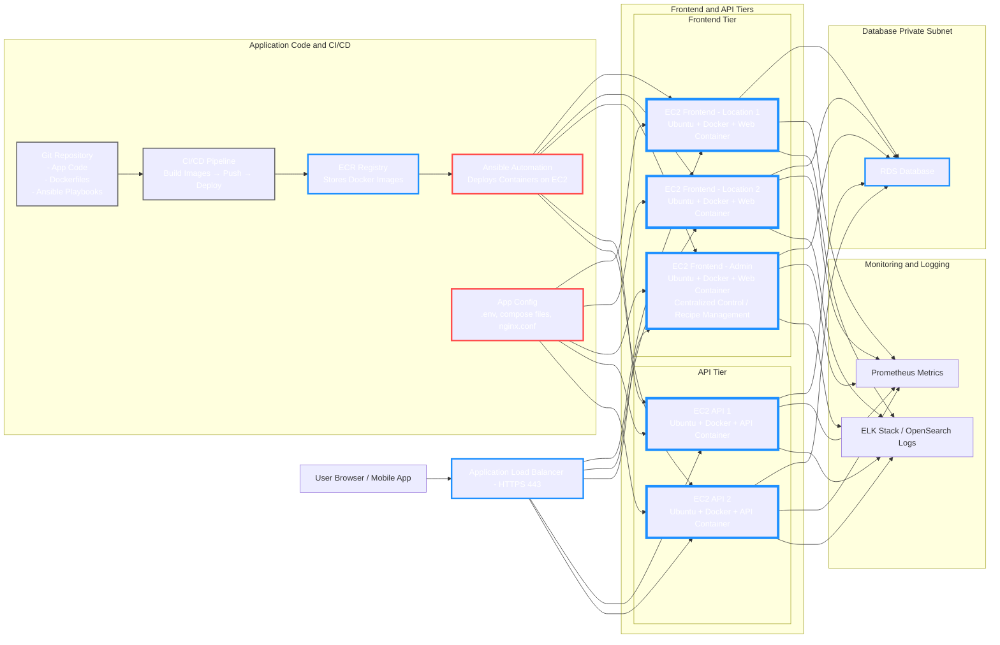

# ChefTec Modern Rebuild

A full, modern recreation of the **ChefTec** application using cloud-native patterns, Infrastructure-as-Code, containerization, and automated deployments.

---

## Project Goals

* Build separate **development** and **production** cloud environments
* Implement **authentication**, **user roles**, and **account management**
* Establish **Git-based workflows** for consistent development
* Deploy **scalable, secure, automated** cloud infrastructure
* Ensure long-term maintainability with Infrastructure-as-Code

---

## Scope

* Full **frontend + backend rebuild**
* **CI/CD automation** for building and deploying containers
* **Terraform-based Infrastructure-as-Code**
* **Ansible automation** for provisioning VMs and Docker services
* Standardized **environment configuration** across Dev/Prod
* Clear **architecture diagrams and documentation**

---

## Cloud Deployment Diagram

High-level view of ChefTec’s cloud deployment:

🟦--> Terraform Managed

🟥--> Ansible Managed

## Why This Architecture

This project is designed for **modularity, scalability, and automation**, reflecting modern cloud and DevOps practices.

### **1. Terraform – Infrastructure as Code**

Manages **persistent cloud resources**: VPC, subnets, ALB, EC2 Auto Scaling Groups, and RDS.

* Ensures reproducible, version-controlled infrastructure
* Serves as a **single source of truth** for all environments

### **2. Ansible – Host Configuration**

Configures EC2 hosts after provisioning:

* Installs packages, Docker, Nginx
* Deploys containers and system-level settings
* Ensures consistent, identical hosts across environments

### **3. CI/CD – Automated Application Delivery**

Pipelines handle **building, testing, and deploying code**:

* CI: Runs tests, builds Docker images, stores them in ECR
* CD: Deploys containers to EC2 hosts via Ansible
* Keeps development, staging, and production consistent

### **4. Containers – Runtime Consistency**

Frontend and API services run in Docker containers:

* Isolated environments, same runtime in dev/prod
* Faster, predictable deployments
* Eliminates “works on my machine” issues

### **5. Multi-Tier Layout**

**Frontend → API → Database** separation:

* Frontend: handles user interaction
* API: handles business logic and database operations
* Database: internal-only access, secure
  **Benefits:** independent scaling, fault isolation, and maintainable architecture

### **6. Private Database**

RDS runs in **private subnets**, accessible only by API/frontend containers, ensuring security and internal-only access.

---

## Tech Stack (Planned)

| Layer              | Tools                                |
| ------------------ | ------------------------------------ |
| Infrastructure     | Terraform                            |
| Host Configuration | Ansible                              |
| Runtime            | Docker                               |
| Cloud Provider     | AWS / Azure / GCP                    |
| CI/CD              | GitHub Actions / GitLab CI / Jenkins |
| Monitoring         | Prometheus, ELK/OpenSearch           |
| App Framework      | Python CLI / GTK / FastAPI / Flask   |
| Database           | SQLite (MVP) / RDS (Cloud)           |

---

## Status

**Active development** – infrastructure, automation, and Python MVP are in progress.

---

## Purpose

This repository is a **learning platform and real-world rebuild** to strengthen:

* Cloud engineering
* DevOps workflows and automation
* Multi-tier application design
* Infrastructure-as-Code practices

---
