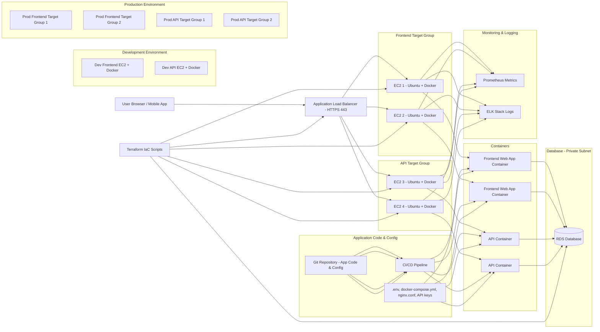

# ChefTec Modern Rebuild

A full, modern recreation of the **ChefTec** application using modern development practices, automation, and cloud-native architecture.

---

## Table of Contents

1. [Project Goals](#project-goals)
2. [Scope](#scope)
3. [Cloud Deployment Diagram](#cloud-deployment-diagram)
4. [Tech Stack (Planned)](#tech-stack-planned)
5. [Status](#status)
6. [Purpose](#purpose)

---

## Project Goals

* Build **development** and **production** environments
* Implement **user accounts, authentication, and role-based management**
* Establish **Git-based version control workflows**
* Deploy **cloud infrastructure** with scalability, security, and automation

---

## Scope

* **Backend & frontend redesign**
* **CI/CD automation** for testing, building, and deployment
* **Infrastructure-as-Code (IaC)** for cloud deployments
* Ensure **environment consistency** using containers or VMs
* Provide **documentation and architecture diagrams**

---

## Cloud Deployment Diagram

High-level view of ChefTec’s cloud deployment:

**Components**:

* **Client**: Browser or mobile app
* **ALB**: Routes HTTPS traffic to frontend/API target groups
* **Target Groups**: EC2 instances hosting frontend/API containers
* **Containers**: Run application code in isolated environments
* **Database (RDS)**: Stores app data in private subnets
* **DevOps / IaC**: Git repository, CI/CD pipeline, Terraform scripts
* **Application Config**: `.env`, container and web server config
* **Monitoring & Logging**: Prometheus metrics, ELK stack logs
* **Dev / Prod Environments**: Separate EC2 instances for safe development and production

---

## Tech Stack (Planned)

* **Application Framework:** TBD
* **Database:** TBD
* **Infrastructure-as-Code / Automation:** Terraform, Ansible
* **Cloud Provider:** AWS / Azure / GCP
* **CI/CD Tools:** GitHub Actions / Jenkins / GitLab CI

---

## Status

* **Active development**

---

## Purpose

This repository is a **learning project** and **practical rebuild** designed to deepen skills in:

* Software architecture
* DevOps workflows
* Cloud engineering
* Infrastructure design and automation

