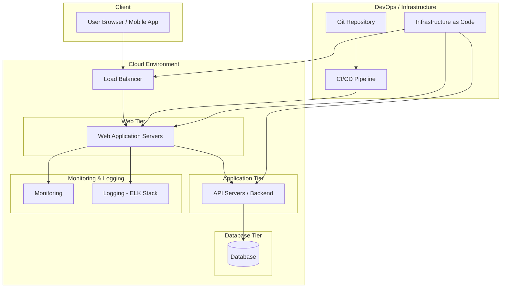

# ChefTec Modern Rebuild

A full, modern recreation of the **ChefTec** application, rebuilt from the ground up using modern development practices, automation, and cloud-native architecture.

---

## Table of Contents

1. [Project Goals](#project-goals)
2. [Scope](#scope)
3. [Cloud Deployment Diagram](#cloud-deployment-diagram)
4. [Tech Stack (Planned)](#tech-stack-planned)
5. [Status](#status)
6. [Purpose](#purpose)

---

## Project Goals

* Build **development** and **production** environments
* Implement **user account creation, authentication, and role-based management**
* Establish **clean Git-based version control workflows**
* Architect and deploy **cloud infrastructure** with scalability, security, and automation in mind

---

## Scope

* **Backend and frontend application redesign**
* **CI/CD automation** for testing, building, and deployment
* **Infrastructure-as-Code (IaC)** for cloud deployments
* Ensure **environment consistency** using containers or VMs
* Provide **documentation and diagrams** for architecture, workflows, and operations

---

## Cloud Deployment Diagram

A high-level view of the planned cloud deployment for ChefTec:

*This diagram represents the flow from client requests through the load balancer, web and application tiers, to the database, with CI/CD, IaC, and monitoring included.*

---

## Tech Stack (Planned)

* **Application Framework:** TBD
* **Database:** TBD
* **Infrastructure-as-Code / Automation:** Terraform, Ansible
* **Cloud Provider:** AWS / Azure / GCP
* **CI/CD Tools:** GitHub Actions / Jenkins / GitLab CI

---

## Status

* **Active development**

---

## Purpose

This repository is both a **learning project** and a **practical rebuild** designed to deepen skills in:

* Software architecture
* DevOps workflows
* Cloud engineering
* Infrastructure design and automation

Do you want me to add that too?
